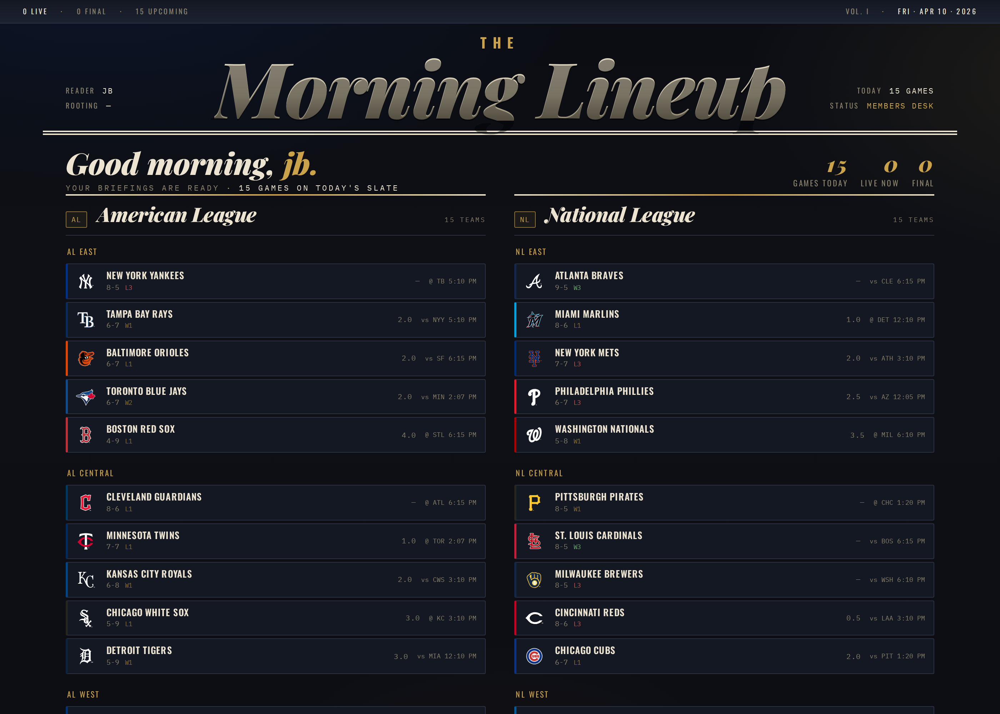
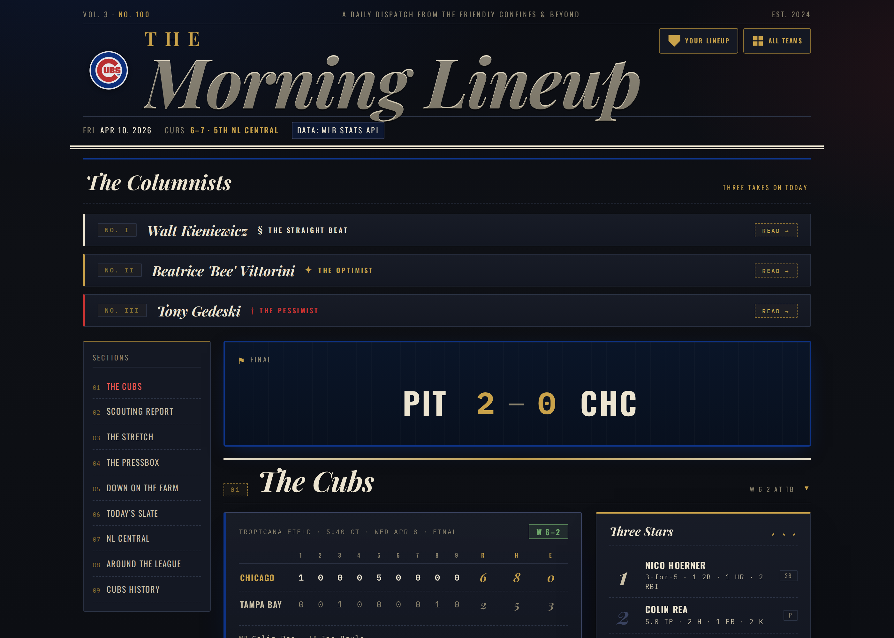
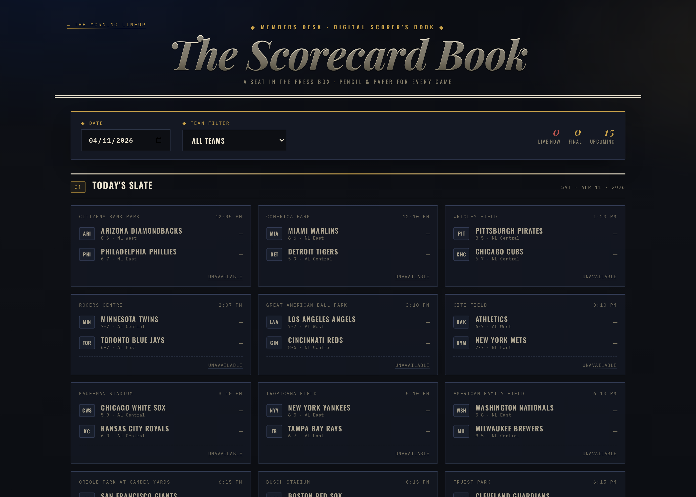

# The Morning Lineup

A daily-updating, auth-gated, LLM-augmented baseball publication covering all 30 MLB teams — with a companion interactive scoring app. Built solo, in about a week, on vanilla Python and vanilla JS.

**Live:** https://brawley1422-alt.github.io/morning-lineup/



## What it is

Morning Lineup started as a replacement for a Gmail-delivered Cubs briefing. It grew into a 30-team editorial sports publication with its own voice, its own design system, and its own autonomous publishing pipeline. Every morning at 6 AM Central, a scheduled Claude agent fetches fresh MLB Stats API data, rebuilds every team's page, regenerates three LLM-authored columnist columns per team, and deploys the whole site to GitHub Pages. You don't read yesterday's news here — the site is built fresh while you're still asleep.

It is also a companion to **The Scorecard Book**, a standalone digital scorer's book for live games: SVG diamond, play-by-play journey, strike zone overlay, multi-game finder, per-team theming.

## What's interesting about it

| Capability | Why it matters |
|---|---|
| **30 teams, one templating system** | Per-team JSON config drives colors, branding, affiliates, rivals, columnist personas. Scale without sameness. |
| **Autonomous daily rebuild** | A Claude agent trigger runs `build.py` + `deploy.py` every morning. The site is never stale and never touched by hand. |
| **LLM columnist pipeline** | 3 personas × 30 teams × daily generation. Ollama (`qwen3:8b`) local-first, Anthropic API fallback, per-persona caching to keep costs sane. |
| **Editorial design system** | Playfair italics, Oswald heads, Lora body, kicker stats, hero grids. Dark newspaper aesthetic with team-specific accent colors injected via CSS variables. |
| **Interactive Scorecard Book** | 11 JS modules, SVG diamond renderer, live MLB feed parser, dark/paper theme toggle. Embedded in each team page and also standalone. |
| **Real auth** | Supabase email/password + OAuth, followed-teams sync, per-user section preferences, custom density modes. Not a login stub. |
| **PWA + offline** | Service worker, cache versioning, manifest per team, installable on mobile. |
| **Screenshot-driven verification** | Playwright harness with fake-auth injection for authed routes. Golden-snapshot tests for section rendering. |
| **Zero dependencies** | `build.py` is 900+ lines of Python stdlib. No pip, no npm, no framework. The whole thing boots on a clean box with `python3 build.py`. |

## Architecture

```
                     ┌─────────────────────┐
                     │  Claude trigger     │  0 11 * * *  (6 AM CT)
                     │  (daily cron)       │
                     └──────────┬──────────┘
                                │ curls build.py + deploy.py
                                ▼
    ┌───────────────┐    ┌──────────────┐    ┌──────────────────┐
    │ MLB Stats API │───▶│   build.py   │◀───│  teams/*.json    │
    │ Open-Meteo    │    │ (orchestrator)│    │  (30 team cfgs)  │
    └───────────────┘    └──────┬───────┘    └──────────────────┘
                                │ delegates to
                                ▼
                     ┌────────────────────────┐
                     │  sections/*.py         │  headline, scouting,
                     │  (11 render modules)   │  stretch, pressbox,
                     └──────────┬─────────────┘  farm, slate, division,
                                │                around_league, history,
                                ▼                columnists
                     ┌──────────────────────┐
                     │  Ollama (qwen3:8b)   │  ─ columnist personas
                     │  → Anthropic API     │    3× per team
                     │  fallback            │
                     └──────────┬───────────┘
                                │
                                ▼
                     ┌──────────────────────┐
                     │  deploy.py           │  archives prior day,
                     │  → GitHub Contents   │  PUTs all 30 team pages
                     │    API               │  + landing + scorecard
                     └──────────┬───────────┘
                                │
                                ▼
                     ┌──────────────────────┐
                     │   GitHub Pages       │  ← Supabase auth gate
                     │   (static)           │  ← service worker / PWA
                     └──────────────────────┘
```

## A few screens

**The briefing — per-team editorial page**


**The Scorecard Book — slate view**


## Tech stack

- **Backend:** Python 3.12 stdlib only (`urllib`, `json`, `zoneinfo`, `html`, `pathlib`)
- **Frontend:** Vanilla JS, no framework, no build step
- **Hosting:** GitHub Pages (static) + Supabase (auth, followed-teams, profile)
- **Data:** MLB Stats API v1/v1.1, Open-Meteo weather
- **LLM:** Ollama local-first (`qwen3:8b`), Anthropic API fallback
- **Automation:** Scheduled Claude agent trigger for daily rebuild + evening post-game watcher
- **PWA:** Service worker, per-team manifests, offline caching

## Repo layout

```
morning-lineup/
├── build.py                 # orchestrator (900+ lines, stdlib only)
├── deploy.py                # GitHub Contents API deploy
├── evening.py               # post-game watcher
├── sections/                # 11 render modules (1 per page section)
├── teams/                   # 30 per-team JSON configs + history/prospects
├── {team-slug}/             # 30 per-team output dirs
├── scorecard/               # Scorecard Book (11 JS modules)
├── home/ landing.html       # public team picker + authed landing
├── auth/ settings/          # Supabase-backed auth + user prefs
├── docs/
│   ├── design/              # 8 editorial prototypes
│   ├── plans/               # feature plans
│   └── images/              # screenshots for this README
├── style.css manifest.json sw.js
└── archive/                 # daily snapshots
```

## Running it locally

```bash
# Build one team
python3 build.py --team cubs

# Build the landing page
python3 build.py --landing

# Serve
python3 -m http.server 8765
# → open http://localhost:8765/cubs/

# Deploy (needs PAT at ~/.secrets/morning-lineup.env)
source ~/.secrets/morning-lineup.env
python3 deploy.py
```

## Credits

Built by [JB Brawley](https://github.com/brawley1422-alt) — Head of Growth at Resolve Logistics, vibe coder by night. Morning Lineup is a personal project; no affiliation with Major League Baseball.

Data: MLB Stats API · Weather: Open-Meteo · LLMs: Ollama + Anthropic Claude · Hosting: GitHub Pages + Supabase
