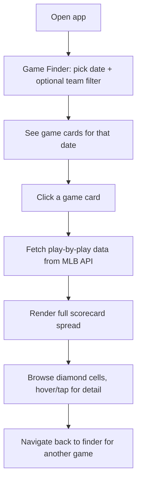

# Digital Scorer's Book

## Problem Frame

Baseball's hand-scored scorecard is one of the sport's most iconic artifacts — a complete visual record of a game compressed into diamond diagrams. But most fans under 40 have never scored a game by hand, and there's no digital tool that faithfully recreates the experience with real MLB data. This project builds a standalone web app that takes any completed MLB game and renders a traditional scorebook spread with SVG diamond diagrams — authentic enough for a scorer, accessible enough for a casual fan.

## User Flow

## Requirements

**Game Finder**
- R1. Date picker defaults to yesterday, with optional team filter dropdown (all 30 MLB teams)
- R2. Display game cards for the selected date showing matchup, final score, and status
- R3. Only completed (Final) games are openable as scorecards
- R4. Shareable URLs via query parameters (e.g., `?game=824457`, `?date=2026-04-07`)

**Scorecard Layout**
- R5. Traditional scorebook spread: away team batting order on left page, home on right page, innings as columns running left to right
- R6. Each lineup slot (1-9) as a row; substitutes (pinch hitters, pinch runners) render as additional sub-rows within their slot
- R7. Each at-bat cell contains an SVG diamond diagram
- R8. Summary stat columns after the final inning (AB, R, H, RBI, BB, K)
- R9. Player name and position in a sticky left column that stays visible during horizontal scroll

**Diamond Cell Rendering**
- R10. SVG diamond showing: basepath highlighting for bases reached, hit type indicator (1B, 2B, 3B, HR, K, BB, etc.), out number, RBI count, and run-scored marker
- R11. Visual encoding: hits use gold basepaths, outs use muted/gray tones with red out numbers, walks/HBP use a distinct accent
- R12. Hover (desktop) or tap (mobile) reveals full detail tooltip: play description, traditional fielding notation (e.g., 6-3), pitch count, pitch sequence

**Game Summary Header**
- R13. Rendered above the scorecard spread: team names, line score (inning-by-inning R + R/H/E totals), final score, venue, date, and pitching decisions (W/L/S)

**Navigation & Responsiveness**
- R14. Horizontal scroll with sticky player column for extra-inning games
- R15. Desktop: full two-page spread side by side. Tablet/mobile: stacked or tabbed (away/home toggle)
- R16. Back button to return from scorecard view to game finder

**Edge Cases**
- R17. Handle doubleheaders (show "Game 1" / "Game 2" labels on finder cards)
- R18. Handle pitching changes with visual annotation in the inning columns
- R19. Handle extra innings gracefully via scrollable columns

## Success Criteria

- A user can pick any date, select a completed MLB game, and view a full scorecard spread that accounts for every at-bat in the game
- Diamond cells are visually readable at a glance and reveal full detail on interaction
- The app loads and renders a 9-inning game in under 3 seconds on a typical connection
- The design feels like it belongs in the same family as Morning Lineup

## Scope Boundaries

- **In scope:** Post-game scorecard viewing for any completed MLB game
- **Out of scope (v1):** Live game scoring / real-time updates, player photos or headshots, historical game archives or search, print stylesheet, keyboard navigation
- **Out of scope (v1) but planned:** Morning Lineup embed as expandable detail view for Cubs games
- **Out of scope (v1) but considered:** Dynamic team color theming (using each team's colors instead of Cubs palette)

## Key Decisions

- **Hybrid notation:** Diamond cells show clean visual indicators at a glance; traditional scoring notation (6-3, K, F8) appears in tooltips on interaction. This makes the app accessible to casual fans without sacrificing authenticity for scorers.
- **Standalone app first:** Ships as its own GitHub Pages site. Morning Lineup embed comes later via iframe with `?embed=1` parameter, keeping development and deployment independent.
- **Morning Lineup aesthetic:** Dark editorial design, same color palette and typography — not a vintage paper look. Ensures the future embed feels native, not bolted on.
- **Any MLB game, not Cubs-only:** Universal tool with broader appeal. Cubs-specific filtering happens naturally when embedded in Morning Lineup.
- **Post-game only (v1):** Avoids the complexity of live polling, partial state, and in-progress at-bat rendering. The data is complete and static.

## Dependencies / Assumptions

- MLB Stats API v1.1 live feed (`/game/{gamePk}/feed/live`) provides complete play-by-play data including runner movements, fielding credits, and pitch sequences — no authentication required
- The `battingOrder` field in boxscore data reliably encodes lineup slot and substitution order
- GitHub Pages for static hosting (no server-side logic needed)

## Outstanding Questions

### Deferred to Planning
- [Affects R10][Needs research] Full mapping of MLB API `eventType` values to traditional scoring notation — verify coverage of edge cases (interference, catcher's interference, balk advancing runners, etc.)
- [Affects R6][Technical] Best approach for rendering double switches where multiple position/lineup changes happen simultaneously
- [Affects R18][Technical] Visual treatment for pitching changes — subtle vertical rule, color shift, or inline annotation

## Next Steps

-> `/ce:plan` for structured implementation planning
