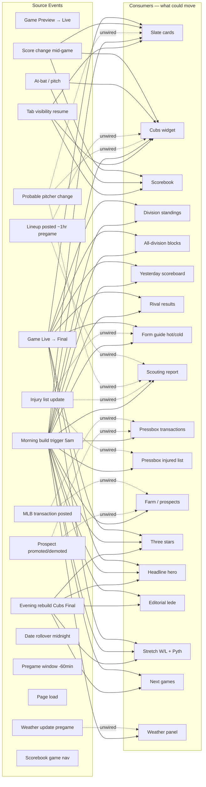

# Morning Lineup — Event Map

*Created 2026-04-10. Living document.*

## Principle

Every "how often should this refresh?" question is really "what event should trigger this?" in disguise. If something upstream already observes the state change, the downstream doesn't need its own timer — it just needs to be kicked. Map the events first, then wire the consumers.

This document catalogs every event Morning Lineup can observe today, what it currently informs, and what it *could* inform. The gap column is where future work lives.

## The Map

**Solid arrows** = already wired (or wired after the unified-live-core ship).
**Dotted arrows** = event exists but nobody listens. These are the gaps.

## Events

### Polled MLB API events (real-world → our data)

| Event | Source endpoint | Observed by | Informs today | Could also inform |
|---|---|---|---|---|
| **Game Preview → Live** | `/v1/schedule` | slate subscriber | slate card, Cubs widget | — |
| **Game Live → Final** | `/v1/schedule` | slate subscriber (post-ship) | slate card, standings (kick), late-finals-if-yesterday | form guide, three stars, Pythagorean, next games card, headline hero if it's your team |
| **Score change (mid-game)** | `/v1.1/game/{pk}/feed/live` | Cubs widget, scorebook | widget, scorebook | slate card (already via the slate poll, but coarser) |
| **At-bat / pitch** | `/v1.1/game/{pk}/feed/live` | Cubs widget, scorebook | situation bar, diamonds | — |
| **Lineup posted (~1hr pregame)** | `/v1.1/game/{pk}/feed/live` → `boxscore.battingOrder` | `fetchPreviewExtras` (one-shot) | preview widget extras | **scouting report refresh** — currently frozen at morning build; lineups post hours later |
| **Probable pitcher change** | `/v1/schedule?hydrate=probablePitcher` | (nothing watches) | — | scouting report, slate card, Cubs widget preview |
| **Transaction posted** | `/v1/transactions?date={today}` | (only morning build) | pressbox | farm section (if call-up/send-down), notification worth surfacing |
| **Injury list update** | `/v1/teams/{id}/roster?rosterType=injuryList` | (only morning build) | pressbox IL | form guide context, scouting report if pitcher IL'd mid-day |
| **Prospect promoted/demoted** | transactions feed | (only morning build) | pressbox | farm prospect tracker |
| **Weather update (pregame)** | MLB venue weather | (only morning build) | weather line in slate | pregame weather panel refresh 30 min before first pitch |
| **Standings change** | `/v1/standings` | standings subscriber (post-ship, derived) | division + all-division | — |

### Time-based events

| Event | Trigger | Observed by | Informs | Gap |
|---|---|---|---|---|
| **Morning build** | 5am CT cron | `build.py` | everything (full regen) | no gap — the static build is the source of truth |
| **Evening rebuild** | Cubs Final detected | `evening.py` | full page regen + redeploy | Could trigger on *any* today game Final if we wanted tighter "three stars" for the headline |
| **Date rollover** | midnight | (nothing — browser just keeps stale state) | — | **Real gap.** Page loaded at 11:55pm still shows yesterday's slate at 12:05am. A clock-watcher event could trigger a slate endpoint refresh with the new date. |
| **Pregame window (T-60min)** | time-of-day | (nothing) | — | Could trigger lineup refresh, scouting report refresh, weather update, notification "game starts in an hour" |

### Client / frame events

| Event | Trigger | Observed by | Informs | Gap |
|---|---|---|---|---|
| **Page load** | user nav | all subscribers at `subscribe()` time | initial render | — |
| **Tab visibility resume** | `visibilitychange` | `live-core` (post-ship) | every subscriber refreshes once | — |
| **Scorebook game nav** | finder click | `scorecard/app.js` | loads new game feed | — |
| **Theme toggle** | scorebook UI | `app.js` | CSS class swap | — |
| **Settings changed** (future) | user action | (no event bus yet) | — | When custom-home lands, settings changes should ripple to the briefing (team pick, layout) without a reload |

## Currently unwired — the gap list

Ranked by reader-value-per-effort. These are the next event→consumer wirings worth planning after the unified-live-core ship.

### 1. Lineup posting → scouting report refresh (HIGH value)

**Event:** `boxscore.battingOrder` becomes non-empty on today's game feed (happens ~1 hour before first pitch).
**Today:** scouting report is rendered at 5am morning build from probable-pitcher data only. No starting lineups yet. Frozen all day.
**Could do:** subscribe to the Cubs game feed (already running post-ship for the widget) and when a lineup appears, refresh the scouting report's "opposition lineup" card. One new derived subscriber, kicked by the Cubs widget's feed subscriber — same timerless pattern as standings.
**Why high value:** lineups are the single most reader-interesting pregame information. Getting them live changes the briefing from "morning preview" to "game-day companion."

### 2. Date rollover → slate reset (MEDIUM value)

**Event:** clock ticks past midnight local time while a tab is open.
**Today:** tab opened at 11:55pm shows yesterday's slate forever. User has to refresh.
**Could do:** tiny time-watcher that fires once at midnight and calls `slateHandle.refreshNow()`. The slate subscriber's endpoint function already uses `today()` so the next fetch will hit the new date automatically. Plus: standings subscriber kicks once too, late-finals subscriber unsubscribes and a new one subscribes for the new "yesterday."
**Why medium value:** low-probability scenario (someone leaves the tab open past midnight) but the fix is ~10 lines and removes a hidden footgun.

### 3. Transaction feed → pressbox live updates (MEDIUM value)

**Event:** `/v1/transactions?date={today}` gets new entries during the day.
**Today:** pressbox is frozen at morning build. A 2pm trade announcement doesn't show until tomorrow.
**Could do:** low-frequency subscriber (every 10 min) polling today's transactions and patching the pressbox table. Farm section is a derived listener — if a transaction is a call-up/send-down, kick the farm subscriber too.
**Why medium value:** transactions are bursty and you don't want to miss the Cubs making a move. But frequency is low, so the absolute win over "reload tomorrow morning" is smaller than #1.

### 4. Injury list update → pressbox + form guide (MEDIUM value)

**Event:** `/v1/teams/{id}/roster?rosterType=injuryList` returns new entries.
**Today:** morning build only.
**Could do:** same low-frequency subscriber as #3, piggybacking on the transactions poll cadence. Pressbox IL side updates. If a hot hitter from the form guide goes on the IL, flag him.
**Why medium value:** injuries propagate slower than transactions — but IL is the one place where the freeze is most user-hostile (you find out your guy is hurt when you open the app tomorrow).

### 5. Probable pitcher change → scouting + slate (LOW value, HIGH surprise factor)

**Event:** `/v1/schedule?hydrate=probablePitcher` diff from what morning build captured.
**Today:** nothing watches. Rare but real — a 10am pitcher swap means the 5am scouting report is wrong all day.
**Could do:** piggyback on the existing slate subscriber — it already hydrates `probablePitcher`. Add a diff check in the slate's `onData`. If any `gamePk`'s probable pitcher changed from morning build state, kick a scouting-report refresh subscriber.
**Why low value:** rare event. But when it happens, the current state is embarrassingly wrong — so the leverage per-incident is high even if the frequency is low.

### 6. Weather update → pregame weather panel (LOW value)

**Event:** venue weather changes between morning build and first pitch.
**Today:** morning build only. If it starts raining at 5pm and first pitch is 7pm, the briefing still shows "clear 72°."
**Could do:** 30-min pre-game subscriber that refreshes weather from MLB's venue endpoint.
**Why low value:** weather is rarely decisive, and most readers will see actual conditions by first pitch anyway. Lowest leverage of the gaps.

## What this map tells us about the architecture

Three patterns worth naming:

1. **The slate is an event fountain.** It already polls once, sees every game state transition, and can kick an arbitrary number of derived subscribers. Standings is the first consumer; scouting-report-on-lineup-post and rival-results on transitions should both reuse the same pattern. The slate's `onData` becomes the central event dispatcher for today-game events.

2. **The morning build is an event too** — just a one-shot, full-page variant. Anything the morning build populates is, in principle, a candidate for live refresh by finding the upstream source event. The question "should this be live?" becomes "is the upstream event worth watching at client-side cadence?"

3. **Some sections have no live source at all** — History, This Day In, Editorial Lede. These are correctly frozen. The map helps distinguish "frozen because there's no event" from "frozen because nobody wired the event yet." Don't waste effort trying to make the first category live.

## Next moves

- Ship unified-live-core first (`docs/plans/2026-04-10-005-feat-unified-live-core-plan.md`).
- After ship, pick from gap list #1 (lineup → scouting) and #2 (date rollover) as the next round — both cheap, #1 is high reader value, #2 closes a real footgun.
- Gaps #3–6 are backlog material; re-read this map when planning the next editorial pass and see which ones have climbed in value.
